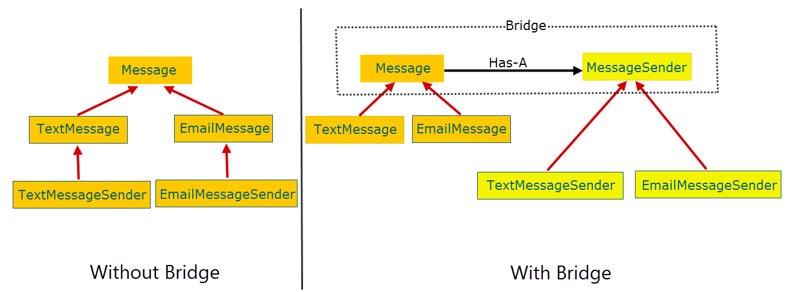

# Bridge
**Mechanism that decouples an interface (hierarchy) from an implementation (hierarchy).**

## Motivation
- Bridge prevents a 'Cartesian product' complexity explosion.(https://stackabuse.com/the-bridge-design-pattern-in-python/)
- Example:
  - Base class ThreadScheduler.
  - Can be preemptive or cooperative.
  - Can run on Windows or Unix.
  - End up with a 2x2 scenario: WindowsPTS, UnixPTS, WindowsCTS, UnixCTS.
- Bridge pattern avoids the entity explosion.

## Summary
- Decouple abstraction from implementation.
- Both can exist as hierarchies.
- A stronger form of encapsulation.